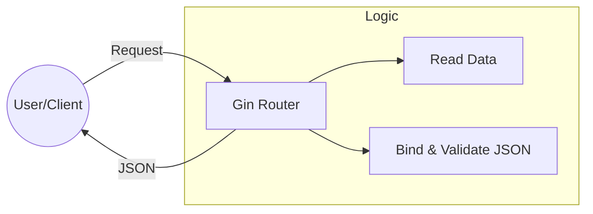

# 🇯🇲 Me-First-API (Go + Gin)

Простой REST-микросервис для управления списком собак и проверки статуса API. Написан на ямайском желании разобраться в эндпойнтах.

## 🛠 Технологии
- **Language:** Go 1.2x
- **Framework:** Gin-Gonic
- **Testing:** Thunder Client / Postman

## 🚀 Быстрый запуск
1. Установите зависимости: `go mod tidy`
2. Запустите сервер: `go run main.go`
3. API будет доступно по адресу: `http://localhost:8080`

## 📡 Эндпойнты (Endpoints)

### 1. Welcome Route
`GET /` — Проверка работоспособности (Healthcheck). Возвращает ямайский вайб.

### 2. Get Hello
`GET /hello` — Базовый ответ сервера.

### 3. Get Dog by Name
`GET /dog/:name` — Возвращает статус конкретной собаки (с пасхалкой в виде HOODRICH).

- **Example:** `/dog/sharik`

### 4. Add New Dog
`POST /dog` — Добавление новой собаки в пак.
- **Body (JSON):**
```json
{
  "name": "БАРБОС",
  "breed": "БАНХАР"
}
```

### 5. Responses

**Success Response** (201 Created): Вы теперь ямайский пакман.

**Error Response** (400 Bad Request): Данила Багров скажет вам базу при кривом JSON.

### 6. Как отличить GET от POST при помощи curl

**GET** 404 ERROR (404-АЯ ОШИБКА)

```bash 
curl http://localhost:8080/
```

**GET** HELLO (БАЗОВЫЙ ОТВЕТ СЕРВЕРА)

```bash 
curl http://localhost:8080/hello
```

**GET** DOG DATA (ГЕТ ПРО СОБАЧЕК)

```bash 
curl http://localhost:8080/dog/sharik
```

**POST** A NEW DOG (ОТПРАВИТЬ ДАННЫЕ В ФОРМАТЕ JSON)

```bash 
curl -X POST http://localhost:8080/dog \
     -H "Content-Type: application/json" \
     -d '{"name": "БАРБОС", "breed": "БАНХАР"}'
```

## 📊 Архитектура (Mermaid)


